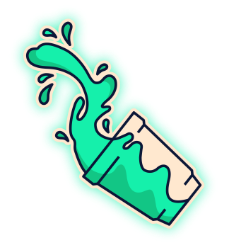

<!--
Hey, thanks for using the awesome-readme-template template.  
If you have any enhancements, then fork this project and create a pull request 
or just open an issue with the label "enhancement".

Don't forget to give this project a star for additional support ;)
Maybe you can mention me or this repo in the acknowledgements too
-->
<div align="center">

  
  <h1>What you're gonna drink today?</h1>
  
  <p>
    Welcome to my project!! 
  </p>
  
  
<!-- Badges -->
<p>

  <a href="">
    
  </a>
  
</p>
   
<h4>
    <a href="https://drink-or-beer.vercel.app/">View Demo</a>
</div>

<br />

<!-- Table of Contents -->
# :notebook_with_decorative_cover: Table of Contents

- [About the Project](#about-the-project)
  * [Screenshots](#screenshots)
  * [Tech Stack](#tech-stack)
  * [Features](#features)
  * [Color Reference](#color-reference)

- [Getting Started](#getting-started)
  * [Run Locally](#run-locally)

- [Contact](#contact)
- [Acknowledgements](#acknowledgements)
  

<!-- About the Project -->
## :star2: About the Project


<!-- Screenshots -->
### :camera: Screenshots

<div align="center"> 
  
  
  
</div>


<!-- TechStack -->
### :space_invader: Tech Stack


  <ul>
    <li><a href="https://developer.mozilla.org/pt-BR/docs/Web/HTML">HTML</a></li>
    <li><a href="https://developer.mozilla.org/pt-BR/docs/Web/CSS/">CSS</a></li>
    <li><a href="https://www.javascript.com/">JavaScript</a></li>
    <li><a href="https://reactjs.org/">React.js</a></li>
    <li><a href="https://styled-components.com/">Styled Components</a></li>
  </ul>


<!-- Features -->
### :dart: Features

- Random Beer
- Random Drink
  
  
  
<!-- API's used -->
### :dart: API's

  <ul>
    <li><a href="https://punkapi.com/">Punk API</a></li>
    <li><a href="https://www.thecocktaildb.com/api.php">The CocktailDB</a></li>
   
  </ul>


<!-- Color Reference -->
### :art: Color Reference

| Color             | Hex                                                                |
| ----------------- | ------------------------------------------------------------------ |
| Body Color |  #081028 |
| Buttons Color |  #9641D4 |
| Text Color |  #15F0AC |


<!-- Getting Started -->
## 	:toolbox: Getting Started

<!-- Prerequisites -->
### :bangbang: Prerequisites

This project uses npm as package manager

  
<!-- Run Locally -->
### :running: Run Locally

Clone the project

```bash
  git clone https://github.com/carvalhodanielg/drink-or-beer.git
```

Go to the project directory

```bash
  cd my-project
```

Install dependencies

```bash
  npm install
```

Start the server

```bash
  npm start
```


  
  
<!-- Contact -->
## :handshake: Contact

Daniel Carvalho - [Linkedin](https://www.linkedin.com/in/carvalhodanielg/) - carvalhodanielg@gmail.com

Project Link: [https://github.com/carvalhodanielg/drink-or-beer)


<!-- Acknowledgments -->
## :gem: Acknowledgements
